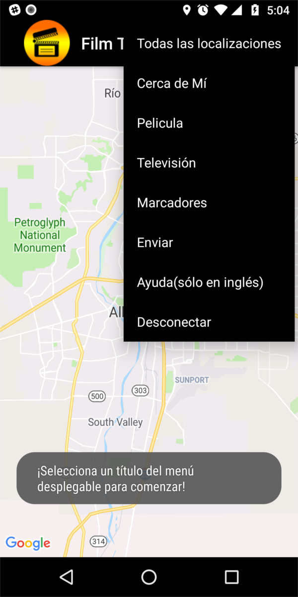
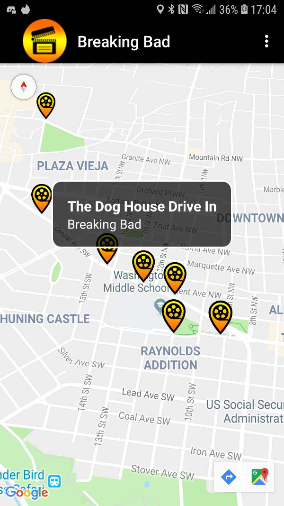
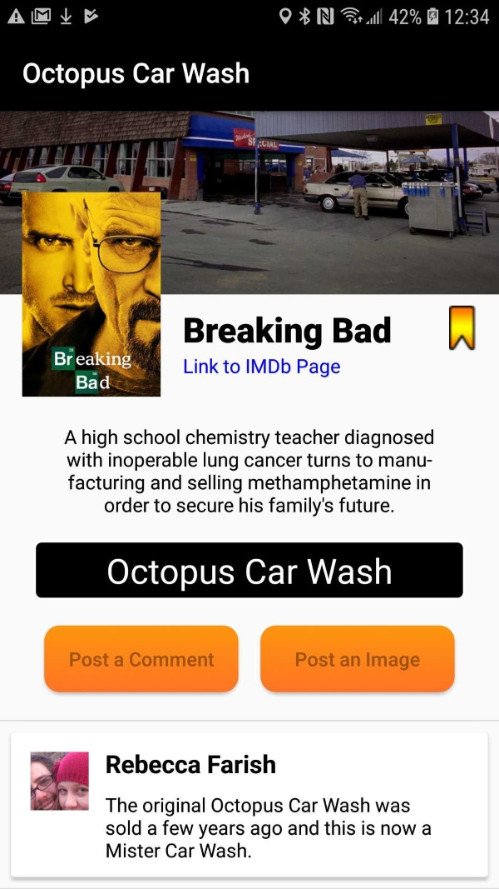

# ABQ Film Tour

### Aims
Albuquerque, New Mexico is becoming a destination for film tourism. It has been featured as a shooting location in many popular movies and television series, iconically for series such as Breaking Bad and Better Call Saul. We believe that there is more potential for tourism and commercial opportunities for the community. Already businesses are capitalizing on tourists attracted by their favorite movies and shows. We hope our app can be utilized to help promote Albuquerque and allow residents and tourists alike to facilitate their own mobile tours of filming locations in the city. Our initial database of locations utilizes city provided open data, but we have also allowed for user submitted content so that enthusiasts can build upon the initial dataset. As businesses such as Netflix expand into the area we believe that our app will create an amazing way to experience the city.

[**Download**](https://www.jscpeterson.com/abqfilmtour.apk)
 

 

 (Screenshot of the menu on opening the app, also demonstrating Spanish support) 

 

 

 (Screenshot of a populated map, filtered by a television series) 

 

 

 (Screenshot of a location with user submitted comment and image) 

 

### Team
We are alumni of the Deep Dive Coding Java+Android+Salesforce bootcamp through CNM and the co-founders of [Odeon LLC](https://odeon.llc/). This application was originally our final team capstone project. We are also the second place winners of the [UNM/CNM App Contest](https://appcontest.unm.edu/). 
 

Contact the team [here](mailto:info@odeon.llc) or contact an individual member for more information.

[**Joseph Scott Peterson**](https://jscpeterson.com)
Fullstack developer, lead backend engineer, set up and maintained the server, set up API security, set up backend to frontend communication, activity stack management, shared preferences and layout design.

[**Rebecca Farish**](https://github.com/rebfarish)
Frontend developer, mathematics consultant, responsible for Google Sign In authentication on the frontend, device permissions, device location, Spanish translations, user accessibility, and layout design, worked on controllers and repositories in backend.

[**Samuel Andazola**](https://github.com/samz0la)
Frontend developer, design manager, created custom logo, splash page, map pins and app theme, in charge of UI/UX and layout design, created dynamic UX wireframes and mockups, worked on controllers and repositories in backend.
 

### Test accounts
- The minimum required Android API is 21. It has been successfully tested on Android emulators and devices running API 22, 23, 26, 27 and 28. There are no known compatibility issues.
- Location services are restricted to function only within Albuquerque city limits.
- The app runs in English and Spanish, however data retrieved from IMDb resources are only offered in English.

### Accessibility
ABQ Film Tour was built with accessibility in mind. All images and buttons have content descriptions in English and Spanish for compatibility with screen readers. The app has been successfully tested with Android's TalkBack and Select to Speak screen readers. The Google Maps directions feature can further assist the visually impaired to navigate to a specific location. 

### Documentation
[Frontend Java documentation](docs/frontend/index.html)  
[Backend Java documentation](docs/backend/index.html)  
[REST API documentation](docs/rest/api.md)  

### Functional inventory
- Client Android application that the end user will use.
- Server side backend REST API. It is a Spring Boot project using an Apache Derby database.
- Client to assist privileged users in moderating the backend database (in development).

Note: All of our repositories are private. If you have any questions or would like to learn more please [email](mailto:info@odeon.llc) us.

### Prototypes
[Adobe XD Prototype](https://xd.adobe.com/view/81f12600-75b1-4f07-7cc3-a86bc45dacf9-f7c0/)  
[User Stories](docs/UserStories.md)  
[ERD](docs/ERD.pdf)

### State of completion
The application currently loads and can populate a map of Albuquerque with film locations stored in a backend database with certain filters provided by the user. The user can view all locations in the database, view all locations in their general vicinity, view locations associated with a film or television series, or view locations that have been flagged as bookmarked by the user. Opening a location map marker provides the user with more information about the production and shoot. The user can submit their location to an existing production in the database, submit a comment to an existing location, or submit an image. These submissions will not be displayed until approved by a member of the team. The team monitors traffic and has the capability to ban malicious users from the service. 

### Stretch goals
- Image completion and retrieval works on the client, however, only the most recent approved image is displayed in the header. To complete this feature we are still working on an image gallery to allow the user to navigate through all of the images submitted to a location.
- Creating a more elaborate user comment system with features including: better user comment boxes with timestamps and display images, a reply to comment feature, and an upvote/downvote voting system to encourage helpful commenting.
- Caching data on the local device so the app is still usable offline, using a persistence library such as ROOM.
- Improving the OdeonClient project to allow anyone who wants to assist with the team limited access to database features for moderation purposes. 
- Further backend security measures, such as request and submission throttling.
- Create premade tours for the most popular productions.
- Translate our usage instructions into Spanish so that the help (ayuda) option on the menu is supported in Spanish.
- Add sponsored locations for local businesses with a unique map pin.

### Third-party libraries
- Google Maps
- Google Authentication
- Retrofit
- Apache CSV
- Circle Image View
- [Glide](http://bumptech.github.io/glide/)

### External services
-  Google Sign In
-  Google Maps
-  [OMDb API](http://www.omdbapi.com/)
-  [City of Albuquerque public film locations](http://data.cabq.gov/business/filmlocations/filmlocationsJSON_ALL) Retrieved on 12/3/2018
- [Cloudinary](https://cloudinary.com/tos)

[Licenses](docs/Licenses.md)  

This site provides applications using data that has been modified for use from its original source, www.cabq.gov, the official website of the City of Albuquerque. The City of Albuquerque makes no claims as to the content, accuracy, timeliness, or completeness of any of the data provided at this site. The data provided at this site is subject to change at any time. It is understood that the data provided at this site is being used at one’s own risk.
